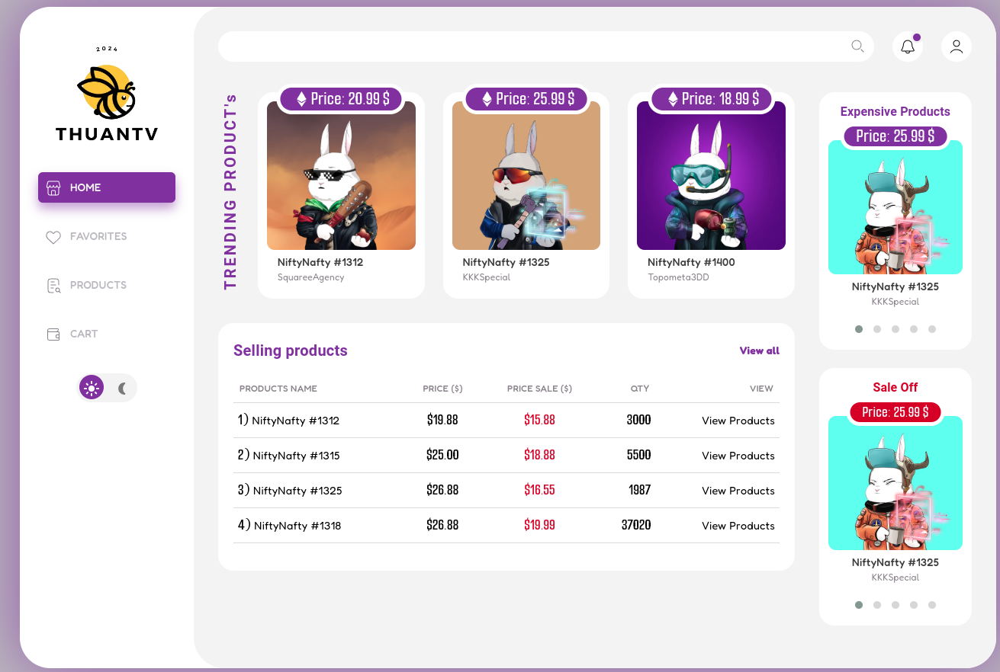

#Module 3
## ================== Bài 1 ======================
Dependency Injection (DI): Là một mô hình quan trọng trong lập trình Angular.
 - Giúp quản lý cung cấp các đối tượng (dependencies) mà một component và service cần để hoạt động. 
 - Làm giảm sự phụ thuộc trực tiếp vào các component và tạo ra các ứng dụng linh hoạt, dễ bảo trì.

 1. Provider: Đối tượng định nghĩa dependency được tạo ra và cung cấp. Có nhiều provider.
    - Ví dụ: useClass, useValue, useFactory

 2. Injector: Là một hệ thống quản lý các dependency và cung cấp chúng khi cần. Injector được sử dụng để inject các dependency vào các component, service hoặc module. Có trách nhiệm tạo đối tượng cung cấp service và inject chúng vào Consumer(Component, service...)
 
 3. NgModule: Là một cách tổ chức ứng dụng thành các module. Mỗi NgModule có thể có một injector riêng. Quản lý các dependency của module đó.

 4. Dependency Tree: Angular xây dựng một cây phụ thuộc (dependency tree) cho ứng dụng, nơi mà mỗi thành phần chỉ định các dependency của nó. Khi một component cần một dependency Angular sẽ tìm trong cây và cung cấp nó.

 5. Dependency là một đối tượng được inject vào component (object có thế là service, function, ... nào đó). 

## Trong ví dụ bên dưới. DataService là một dependency được inject vào ExamComponent thông qua constructor. Angular sẽ tự động xác định để tạo và cung cấp một instance (yêu cầu) của DataService khi ExamComponent được khởi tạo.
// Định nghĩa một service
class DataService {
  getData() {
    return 'Data from the service';
  }
}

// Sử dụng DI để inject service vào component
@Component({
  selector: 'app-example',
  template: 'Data: {{ data }}',
})
class ExampleComponent {
  constructor(private dataService: DataService) {
  }

  ngOnInit() {
    this.data = this.dataService.getData();
  }
}

RxJS (Reactive Extensions for Javascript) là một thư viện lập trình của reactive programming (lập trình ứng dụng) cho Javascript, và nó được sử dụng rộng dãi trong Angular để xử lý các tác vụ không đồng bộ và quản lý luồng dữ liệu. RxJS thường được sử dụng để làm việc với các sự kiện HTTP requests, và các tác vụ không đồng bộ khác trong ứng dụng Angular.
Có khá nhiều concept trong Angular sử dụng đến RxJS như là Forms, HttpClient, hay như là QueryList, EventEmitter, etc.
- Một số khái niệm cơ bản của RxJS và cách nó sử dụng trong Angular.

 1. Observable: Là một loại đối tượng mà bạn có thể subscribe để theo dõi và xử lý các sự kiện hoặc giá trị được phát ra theo thời gian. Observable có thể phát ra nhiều giá trị, hoặc chỉ có một giá trị, hoặc không có giá trị nào.
 2. Observer: Là một đối tượng có các phương thức để xử lý các sự kiện được phát ra từ một Observable. Các phương thức chính là next() để xử lý giá trị mới. error() để xử lý lỗi, và complete() để xử lý khi Observable hoàn thành.
 3. Operator: Là các hàm được xử dụng để xử lý và biến đổi dữ liệu trong các Observable. RxJS cung cấp nhiều operators như map, filter, merge, concat và nhiều operators khác để thực hiện các thao tác như lọc, biến đổi, kết hợp và chuyển đổi dữ liệu.
 4. Subscription: Là quá trình kết nối một Observer với một Observable. Subcription có thể quản lý để hủy đăng ký (unsubcribe) khi không cần theo dõi nữa. giúp tránh rò rỉ bộ nhớ.
 5. Schedulers: Một scheduler sẽ điều khiển khi nào một subscription bắt đầu thực thi, và khi nào sẽ gửi tín hiệu đi.

Angular là một full-fledged framework, nó đã cung cấp sẵn hai giải pháp cho Forms là Template-driven Forms và Reactive Forms hay còn gọi làm Model-driven Forms.

 1. Template-driven Forms: Cơ chế hoạt động của dạng forms này sẽ chủ yếu dựa vào các directives trên template như NgForm, NgModel, required, etc; để làm việc. Form dạng này sử dụng Two-way binding để update data model giữa template và component.
 2. Reactive Forms: Chúng ta sẽ xây dựng form từ các model, là các object có một số chức năng đặc biệt để quản lý được các form input. Nó cũng sử dụng một số (nhưng rất ít) các directives.

  Với AngularJS các qui luật kiểm lỗi được tăng cường, giúp bạn kiểm lỗi thuận tiện hơn.
  AngularJS không những cho biết tình trạng lỗi của các control mà còn cho biết tình trạng lỗi của form.
  Hơn thế nữa, nó còn cung cấp các class CSS giúp trình bày theo từng tình trạng lỗi.
  Và bạn có thể định nghĩa thêm các thuộc tính kiểm lỗi riêng của mình. Để biết được một điều khiển đã nhập đúng như điều kiện kiểm lỗi hay chưa bạn cần kiểm tra $valid của điều khiển đó.

  - Các thuộc tính trong angularjs cho biết trạng thái lỗi của control trong form
  - AngularJS cung cấp nhiều thuộc tính (bắt đầu là dấu $) giúp bạn biết được tình trạng lỗi của các control trong form, như: $dirty, $pristine…
  
  $untouched - Chưa tác động - frm1.txt1.$untouched
  $touched -	Đã tác động	- frm1.txt1.$touched
  $pristine	- Chưa có sửa chữa	- frm1.txt1.$pristine
  $dirty - Đã có sửa chữa	- frm1.txt1.$dirty
  $invalid	- Chưa hợp lệ	- frm1.txt1.$invalid
  $valid	- Đã hợp lệ	- frm1.txt1.$valid

  - Các thuộc tính cho biết trạng thái lỗi của form
  - AngularJS cũng cung cấp cho bạn các thuộc tính để biết tình trạng lỗi nhập dữ liệu của form, như: $invalid, $pristine…

  $pristine	- Chưa có sửa chữa - frm1.$pristine
  $dirty	- Đã có sửa chữa	- frm1.$dirty
  $invalid	- Chưa hợp lệ -	frm1.$invalid
  $valid -	Đã hợp lệ	- frm1.$valid
  $submitted	- Đã gửi dữ liệu	- frm1.$submitted

  - Định dạng trạng thái lỗi
  - AngularJS cung cấp các CSS class cho phép bạn định dạng các trạng thái lỗi của form. Ví dụ:
  input.ng-invalid{} => định dạng cho các thẻ <input> có dữ liệu không hợp lệ
  form.ng-pristine{} => định dạng cho các form chưa có tác động sửa chửa

  - Css class cho các trạng thái lỗi của form và control trong form
  - Các class css của các control trong form
  .ng-untouched	- Chưa tác động
  .ng-touched	- Đã tác động
  .ng-pristine	- Chưa có sửa chữa
  .ng-dirty	- Đã có sửa chữa
  .ng-invalid	- Chưa hợp lệ
  .ng-valid	- Đã hợp lệ
  .ng-invalid-key	- Chưa hợp lệ key
  .ng-valid-key	- Đã hợp lệ key

  - Các class css trạng thái cho form
  .ng-pristine	Chưa có sửa chữa
  .ng-dirty	Đã có sửa chữa
  .ng-invalid	Chưa hợp lệ
  .ng-valid	Đã hợp lệ
  .ng-submitted	Đã gửi dữ liệu
  .ng-invalid-key	Chưa hợp lệ key
  .ng-valid-key	Đã hợp lệ key

  - Định nghĩa kiểm lỗi mới cho các control
## Tham Khảo Thêm: https://docs.angularjs.org/api/ng/directive/
## https://github.com/angular-vietnam/100-days-of-angular/blob/master/Day034-template-driven-forms-2.md

- Trong Angular, Reactive Forms là một phương pháp để quản lý trạng thái và tương tác với các biểu mẫu. Nó là một cách mạnh mẽ để xử lý biểu mẫu, kiểm soát trạng thái của biểu mẫu và thực hiện xác nhận dữ liệu.

- Thuật ngữ Reactive Forms hay còn được gọi là Model-driven Forms, là một phương pháp để tạo form trong Angular, phương pháp này tránh việc sử dụng các directive ví dụ như ngModel, required, etc, thay vào đó tạo các Object Model ở trong các Component, rồi tạo ra form từ chúng. Một điều lưu ý đó là Template-driven Forms là async còn Reactive Forms là sync.

- Trong Reactive Forms, chúng ta tạo toàn bộ form control tree ở trong code (khởi tạo ngay, khởi tạo trong constructor, hoặc khởi tạo trong ngOnInit), nên có thể dễ dàng truy cập các phần tử của form ngay tức thì.

- Form state ở trong Reactive Forms là immutable, mỗi sự thay đổi của form state sẽ đều tạo ra một state mới.

- Validator functions
*Có 2 loại validator function:
*1. Sync validators (đồng bộ)
Đây là các function để validate thường gặp, sẽ nhận đầu vào là một form control và trả về ngay lập tức:
Một danh sách các validation errors.
Hoặc null tức là control này ko có lỗi gì.

*2. Async validators (bất đồng bộ)
Đây là các validate function sẽ trả về Promise hoặc Observable mà kết quả sẽ được emit trong tương lai. Ví dụ như bạn muốn validate xem username nhập vào đã có trong hệ thống hay chưa. Thì bắt buộc bạn phải gửi một yêu cầu lên server để làm việc này, HTTP request thường sẽ trả về Promise/Observable.
## Tài liệu tham khảo https://github.com/angular-vietnam/100-days-of-angular/blob/master/Day036-reactive-forms-2.md

Async Validators là một trong những tính năng mạnh mẽ của Reactive Forms. Async Validators để thực hiện kiểm tra giá trị form là hợp lệ hay không dựa trên các xử lý bất đồng bộ (ví dụ: kiểm tra sự tồn tại của một email trong cơ sở dữ liệu).

Trong Angular, events, DOM, và output properties đều là các khái niệm quan trọng liên quan đến việc tương tác với giao diện người dùng và truyền thông tin giữa các thành phần.

1. Events trong Angular:
Trong Angular, bạn có thể lắng nghe sự kiện (event) từ DOM bằng cách sử dụng cú pháp (event) trong template. 

2.DOM trong Angular:
Angular giúp bạn tương tác với DOM thông qua ViewChild hoặc ElementRef. ViewChild cho phép bạn truy cập vào một hoặc nhiều tham chiếu đến các thành phần con trong template.

3.Output Properties trong Angular:
Output properties là một cách để các thành phần con có thể gửi thông điệp (events) lên các thành phần cha. Bạn có thể sử dụng EventEmitter để tạo output properties.

# HTTP client, interceptors, và error handling.

 1.HTTP client là một module mạnh mẽ để thực hiện các yêu cầu HTTP đến các API. Bạn có thể sử dụng HTTP client để gửi các loại yêu cầu như GET, POST, PUT, DELETE, và nhiều hơn nữa. Các interceptors là một phần quan trọng của HTTP client, cho phép bạn thực hiện các xử lý trước hoặc sau khi yêu cầu được gửi hoặc trước khi phản hồi được trả về. Error handling là một khía cạnh quan trọng để xử lý lỗi trong quá trình gửi và nhận dữ liệu từ server.
 - Trước tiên, bạn cần import module HttpClientModule vào ứng dụng Angular của bạn và thêm nó vào phần imports của @NgModule trong file app.module.ts:
 Tiếp theo, bạn có thể sử dụng HttpClient để thực hiện các yêu cầu HTTP trong các service hoặc component:

 2.Interceptors:
  Interceptors là một cơ chế mạnh mẽ để thực hiện các xử lý trước hoặc sau khi yêu cầu được gửi và trước khi phản hồi được trả về. Bạn có thể sử dụng interceptors để thêm header, xử lý lỗi, log thông tin, và nhiều công việc khác.

 3. Các lỗi có thể xảy ra trong quá trình gửi yêu cầu hoặc nhận phản hồi từ server. Bạn có thể sử dụng catchError để xử lý lỗi trong các observable:

# Dynamic components, component factory resolver, và entry components.
Trong Angular, Dynamic Components là một khái niệm mạnh mẽ, cho phép bạn tạo và render các thành phần tại thời điểm chạy. Để tạo và render dynamic components, Angular sử dụng ComponentFactoryResolver và có một khái niệm liên quan là "entry components".
Dưới đây là một cái nhìn tổng quan về cách sử dụng Dynamic Components, ComponentFactoryResolver, và entry components trong Angular:

1. Dynamic Components:
Dynamic components là các thành phần có thể được tạo ra và thêm vào DOM tại thời điểm chạy. Điều này là hữu ích khi bạn muốn tạo ra các thành phần mà không cần định nghĩa trước trong template.

2. Component Factory Resolver:
ComponentFactoryResolver là một service trong Angular, giúp bạn tìm hoặc tạo ComponentFactory cho một loại component cụ thể. Bạn có thể sử dụng ComponentFactoryResolver để tạo ra một ComponentRef và sau đó thêm nó vào DOM.

3. Trong Angular, "Entry Components" là một khái niệm được sử dụng để chỉ ra các thành phần mà Angular không biết trước và cần phải tạo ra tại thời điểm chạy (runtime). Trước khi Angular Ivy (Angular 9 trở lên), việc khai báo entry components trong entryComponents array của module là bắt buộc. Tuy nhiên, với Angular Ivy, việc này không còn là một yêu cầu cần thiết.

Một entry component là một thành phần mà bạn sẽ tạo và thêm vào DOM động (tại thời điểm chạy) bằng cách sử dụng ComponentFactoryResolver và ViewContainerRef. Điều này thường xuyên xảy ra khi bạn muốn tạo và hiển thị một thành phần tại một điểm bất kỳ trong ứng dụng của mình dựa trên logic runtime.

## Project view.
